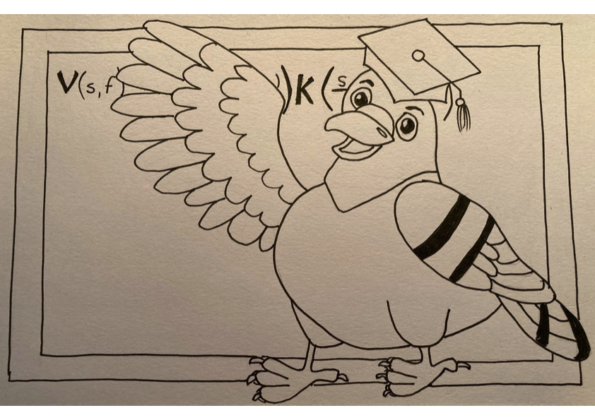

To learn more: PLUMED Tutorials!
-----------------------------

PLUMED-TUTORIALS is a living textbook that teaches students about the research done by the researchers who are in the PLUMED consortium. All members of the consortium can upload tutorials that explain how methods that they have developed can be used. Members retain control over the lessons they contribute so they can keep easily keep the content current. The PLUMED-TUTORIALS website monitors the compatibility of any PLUMED input files within these lessons with the current and development versions of the code and integrates links from these files to the PLUMED manual. The lessons in the PLUMED-TUTORIALS thus provide a rich set of learning resources that students can employ when they first learn to use PLUMED

**Check it out [here](http://www.plumed-tutorials.org)!**

